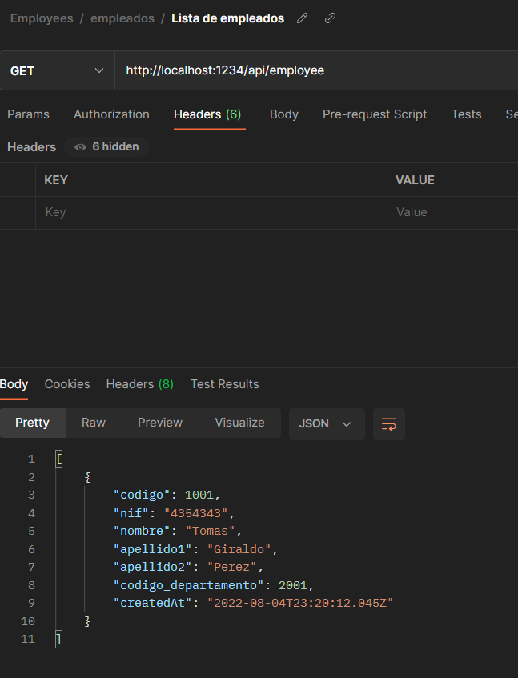
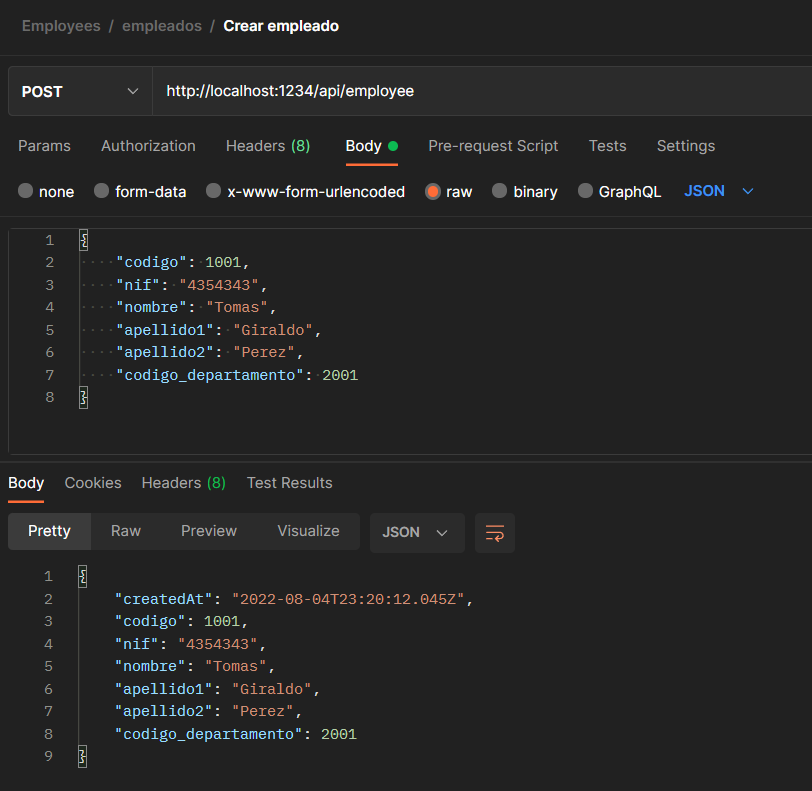
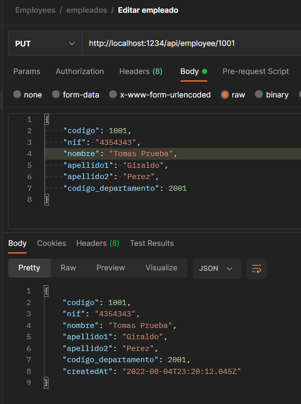
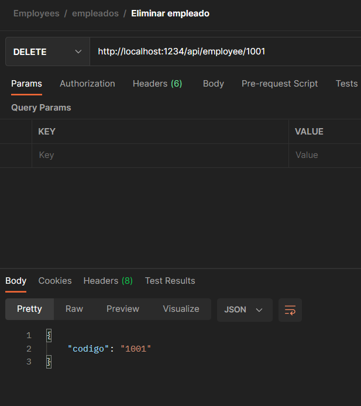
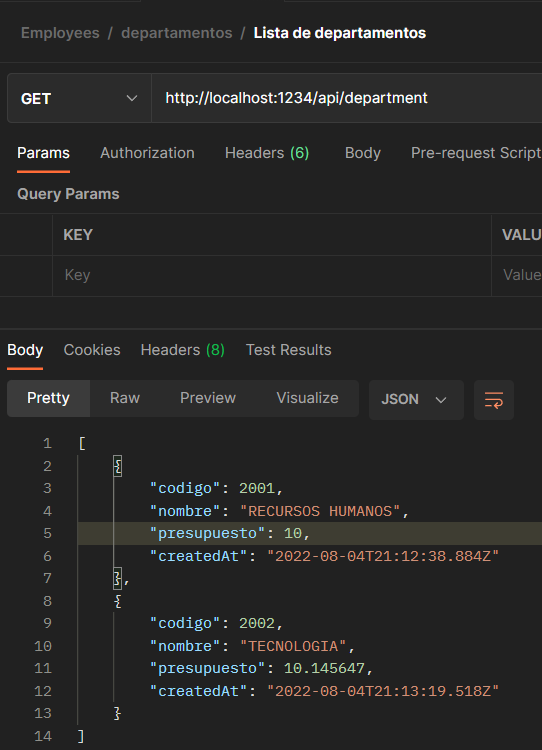
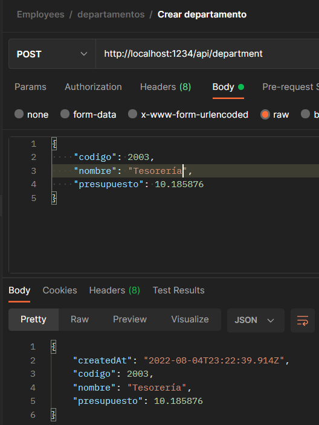
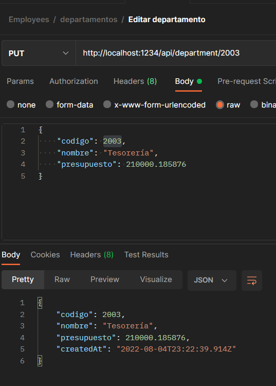
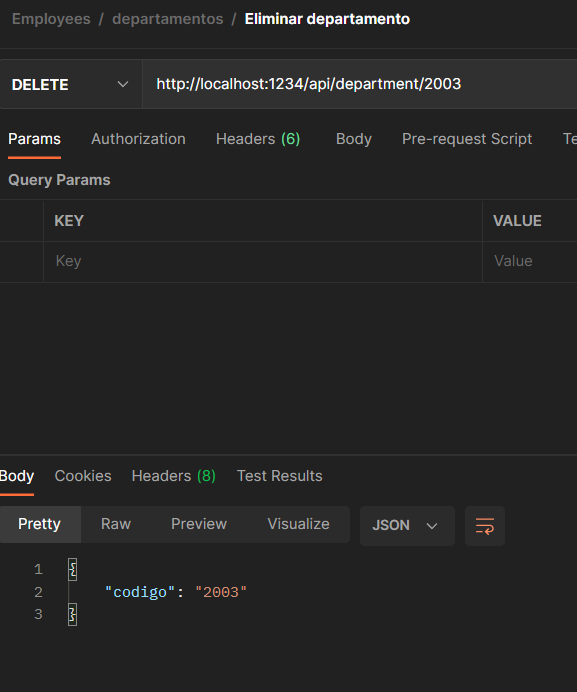

# Backend con Node JS

En este proyecto encontrara un microservicio API REST, el cual soportará un modelo de empleados y departamentos en el cual podrá crear, listar, editar y eliminar (CRUD) regirstros para cada una de las tablas.

## Estrategia de diseño de la aplicación

Este proyecto se ha desarrollado utilizando Node Js con la libreria Express JS, en donde se podran realizar solicitudes http que devuelvan respuestas JSON válidas, las cuales se guardan de manera automatica en la base de datos de PostgreSQl haciendo uso del ORM Sequelice

## Iniciemos

Siga los subtemas a continuación para configurar su entorno, ejecutar el servidor web y trabajar con los endpoints del API REST.

#### Requisitos del sistema operativo
Asegúrese de que se cumplan los siguientes requisitos antes de comenzar.

- Cliente git
- Node >= v16.14.2
- Un cliente web como Postman o Insomia
- Docker
- docker-compose

#### Clonar el repositorio

```sh
git clone git@github.com:Daniela10289/employee_backend.git
```

#### Configurar variables de entorno

Asegúrese de configurar el archivo con nombre ".env" en la raiz del proyecto, puede utilizar como referencia el archivo con nombre ".env-example".

Este archivo contiene las configuraciones de puerto HTTP y de acceso a la base de datos

#### Iniciar el servidor web y base de datos

Este proyecto se debe inicializar con la herramienta Docker y docker-compose, por lo cual es necesario ejecutar los siguientes comandos para su correcto funcionamiento.

Iniciar la base de datos (en segundo plano)
```sh
docker-compose up -d contenedor_postgres
```
Iniciar el contenedor de la aplicación (en primer plano)
```sh
docker-compose up contenedor_web_node
``` 

Si desea iniciar ambos contenedores puede ejecutar:

```sh
docker-compose up -d
``` 

Para detener y eliminar los contenedores utilizar el comando

```sh
docker-compose down
``` 

## Realización de solicitudes HTTP

Una vez iniciados ambos contenedores en su terminal, se mostrará el puerto del API en la consola y podrá realizar las peticiones desde Postman, Insomia o el cliente HTTP de su preferencia.

El archivo postman "Employees.postman_collection.json" cuenta con la estructura para cada uno de los servicios construidos (empleados y departamentos) y cada uno de sus métodos HTTP, puede usar este archivo para importarlo en su cliente Postman.   

## Capturas de pantalla del funcionamiento de cada uno de los endpoints

| Nombre endpoint | Captura del resultado |
| ------ | ------ |
| Listar empleados |  |
| Crear empleado |  |
| Editar empleado |  |
| Eliminar empleado |  |
| Listar departamentos |  |
| Crear departamento |  |
| Editar departamento |  |
| Eliminar departamento |  |
